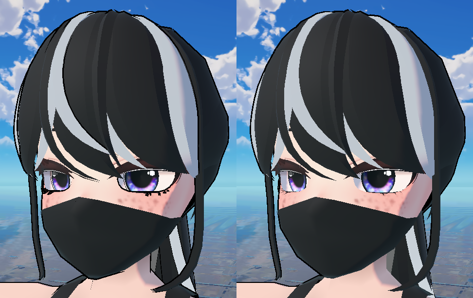
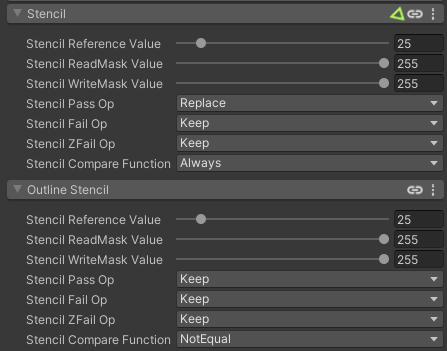
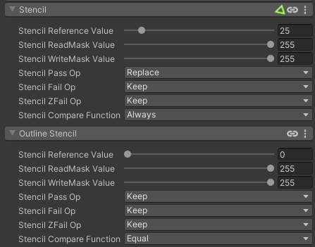

*Before/After Stencilled Outlines*

When using the [Outlines](/outlines/main) module, outlines are generated by offsetting the original mesh along its normals, with front face culling (known as the Inverse Hull or Inverted Hull technique) This generally works well, but outlines will be visible anywhere there's mesh borders - this is especially visible for things like pupils, eyelashes, and other interior geometry. While you can use an outline thickness mask for this, for many applications, we only want outlines on the outside of the mesh.

To fix this, we can use [stencils](/rendering/stencil). Stencils are a DirectX feature that allow values to be set by a material in a special buffer, which later passes and materials can use to determine whether a pixel should be drawn or not. Stencils are very flexible and can be used for a lot of different effects - we're going to use them to set up our outline so that it only draws outside the mesh.

## Setup

When the Outlines module is enabled, an additional section for Outlines is added to the Stencil section at the bottom of the shader. We can set up these options a few different ways to get the desired result; here's one way that works well.

*Stencilled Outline Settings*

The specific value of the Stencil Reference Value doesn't matter; it just has to be something other than 0, and that it matches between both stencil settings.

If you just wanted to get the effect, you're done! If you want to understand more about why this works, read on.

## How it works

By default, the stencil buffer is set to 0 for every pixel. For the base pass of the material, we set the stencil value to something other than 0, with a stencil compare function of `Always`. This means that the stencil buffer will be set to our value for every pixel the material draws.

For stencils to work, one pass/material has to be written before another pass/material reads from it. In this case, the outline pass is drawn after the base pass, so it can read the modified stencil buffer. If the value is `NotEqual` to the reference value, the outline is drawn - meaning wherever the base material drew a pixel, the outline will not render.

### Alternate Setup

*Alternate Stencilled Outline Settings*

This setup has the same result, but works in a slightly different way. It writes a non-zero value to the stencil buffer wherever the base material draws. The outline pass reads from the stencil buffer and only renders where the stencil buffer has its default value of 0.

This setup would result in outlines potentially not rendering where other materials use the stencil buffer, which may or may not be desirable.
