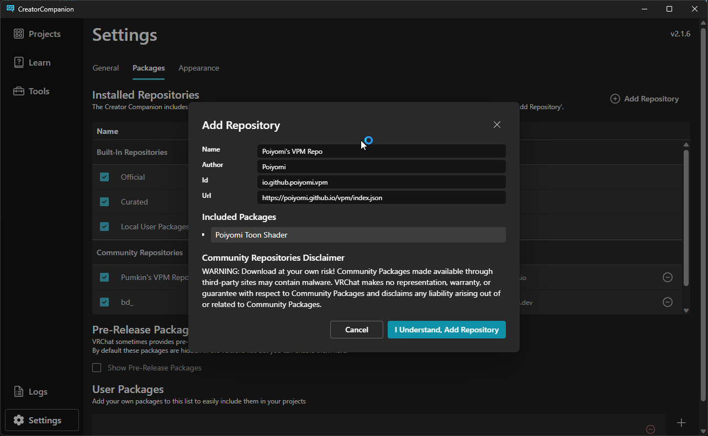

*2024-06-01: Updated with new links*

When utilizing the Poiyomi Toon Shader through VCC, you have the option to set it up for your project. However, there are some essential considerations to keep in mind, and we'll provide a detailed guide to help you through the process.

### Setup

To initiate the use of the Poiyomi Toon Shader via VCC, follow these steps to ensure a smooth setup:

1.  **Check Existing Installations**: Prior to proceeding, it's crucial to verify whether Poiyomi is already installed in your project. This step is essential to prevent conflicts or unexpected behavior.

2.  **Adding the Shader to Repo Listing**: If you have the latest VCC installed, follow these steps:

- Go to the Downloads Page [http://poiyomi.com/download](/download).

- Click "Add to VCC" on the instructions for Method 2.

- Follow the prompts provided to add the shader to your VCC.

3.  **Adding Packages to a Project**: Within the VPM Interface, perform the following actions:

- Select your project.

- Find the "Selected Repos" dropdown.

- Check "Poiyomi's VPM Repo."

- Choose the package you wish to add and click the plus button.

If you manage to come accross any issues, don't be shy to join [✨ Poiyomi Shaders Discord ✨](https://discord.gg/poiyomi) and head to **#shader-problems** channel!
