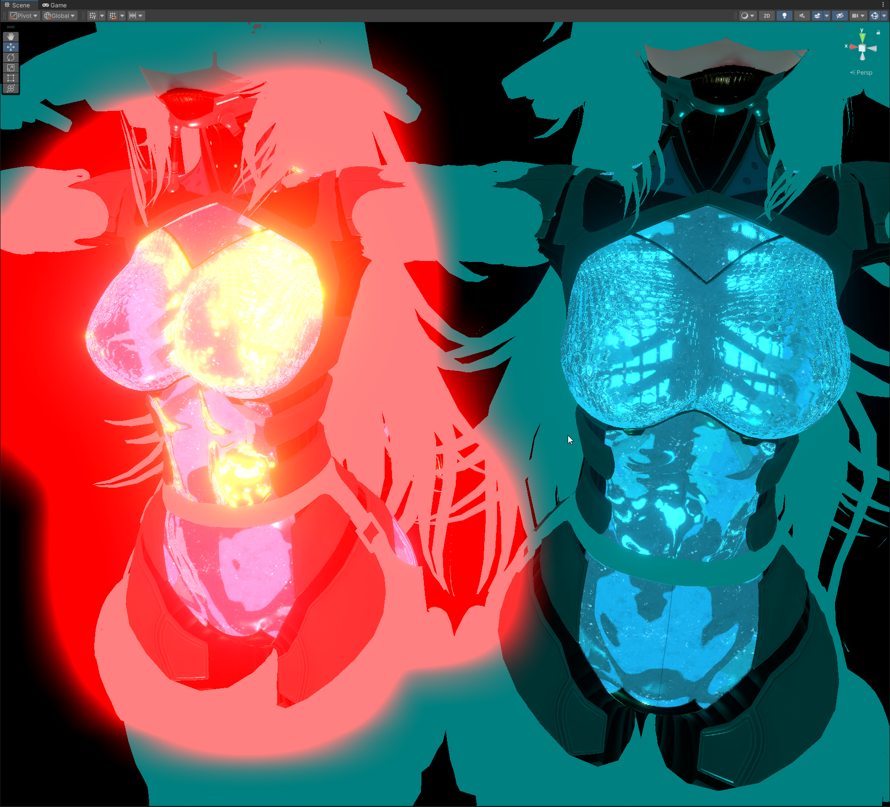

This update contains some important improvements and fixes to the Grab Pass shader, as well as some small additions. The Toon version is now available in the VCC Repository, GitHub, and on BOOTH.

Importing this version for the first time may take longer than usual, but this should be a one-time thing.

*Above Example Image: Comparison between the previous version vs. this update in the Grab Pass shader. Left is Old, Right is New.*

### Added
- Added a million new **Presets** for the Shader.
- Added Preset button to Section Headers to allow section-specific Presets to be applied.
- Added a `Fresnel Strength` slider to **Reflections & Specular** and **Clear Coat**.
  - This controls the low-angle reflective rim intensity, similar to Unity Standard.

### Changes
- Grab Pass now has a new Color section. This is just a simple little section for now that will become of use later on.

### Fixed
- Fixed a serious bug causing Grab Pass to get insanely bright in 0 light value worlds.
  - The Grab Pass in Poiyomi Shaders can do a lot more than most Grab Pass shaders in terms of layering things on the transparent surface. Unfortunately, a byproduct of this caused some bad lighting bugs.
  - Features such as Emissions, Rim Lighting, and Matcap, will no longer use their respective Mix with the Base Color as a result of this important bug fix. I tried to find another way, but at the moment it's just not possible.