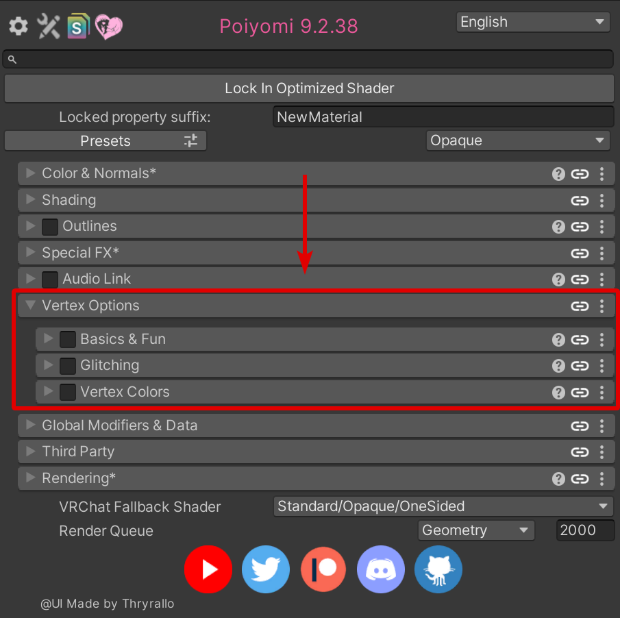

Heya, BluWizard here! Just wanna hop in to give you a scoop on Poiyomi 9.2, a major update to the shader!

While most of the features haven't changed, this update has introduced native support for [VRC Light Volumes](https://github.com/REDSIM/VRCLightVolumes), an excellent voxel-based Light Probes replacement for VRChat Worlds. Alongside that, are various amount of bug fixes and improvements! See the [Changelog](/changelog) Blog for all the details.

## VRC Light Volumes

What's so special about VRC Light Volumes is that it allows for more natural lighting to show on your Avatar, making for stellar appearances in photos. Here are just two examples of what this can look like on Sacred's Avatar...

Notice that in these images above, the light tubes are able to emit very evenly across the Body. Compared to before, it was only able to be an approximate.

Here's a comparison on DrBlackRat's Avatar. Pay attention to the differences between Poiyomi 9.2 (latest) vs. Poiyomi 9.1 (older version)...

As you can see, the results can be very obvious! The Material appears more evenly illuminated from the environment compared to previously.

Since VRC Light Volumes was created since earlier this year, you should begin to notice more and more Worlds adopt this system. Adding support for VRC Light Probes can make the shader future-proof to newer Worlds that plan to take advantage of this new lighting system.

**The best part of all this? You don't have to do anything to your Materials!** It's automatically enabled in the back-end. All you need to do is make sure to update to the latest version of Poiyomi Shaders and just simply set your Materials to use the latest version.

## Vertex Options Reorganized

Let's quickly talk about another significant change introduced in 9.2. **Those who have used Vertex Options, Vertex Glitching, and Vertex Colors should read this!**

In the latest version, you may have noticed that those sections have gone missing from the `Color & Normals` category. This is intentional! We have reorganized them into a brand new category in the shader UI, under `Vertex Options`. It is located <u>in-between</u> `AudioLink` and `Global Modifiers & Data` section.

Underneath this area, we have renamed those sections into simply, `Basics & Fun`, `Glitching`, and `Vertex Colors` respectfully. If you have used these features under the old names before, don't worry! All your existing configurations should transition over seamlessly when updating your Materials.

Why did we do this? Well, this is to make way for another upcoming vertex-based feature called `LookAt`, which is right now being tested in the Pro version of the shader. We'll talk about that sometime in the future.

## Conclusion

We hope you enjoy these new improvements to Poiyomi Shaders! As always, feel free to shoot us a message in our Discord Server for any questions or comments. Also if you have any pictures of your Avatars using the newest version, we invite you to share them there in our `#showcase` and `#in-game-pics` channels!

[Click here to see the Patch Notes](/changelog/poiyomi-toon-9-2-36-changes)