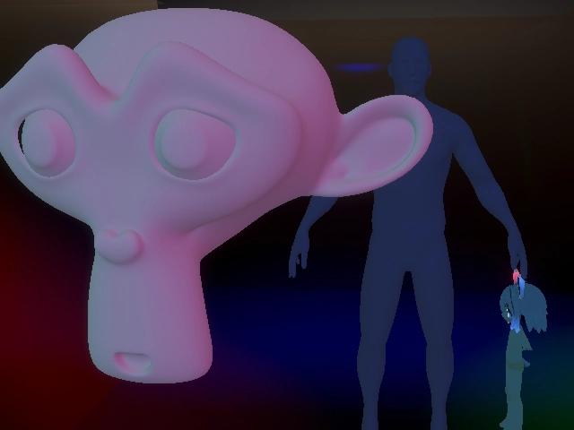
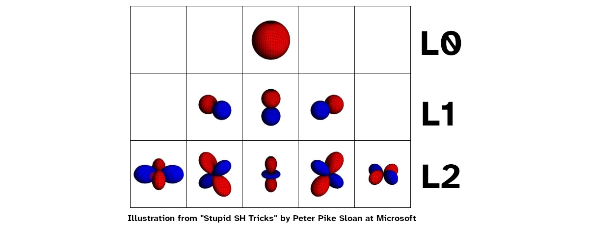
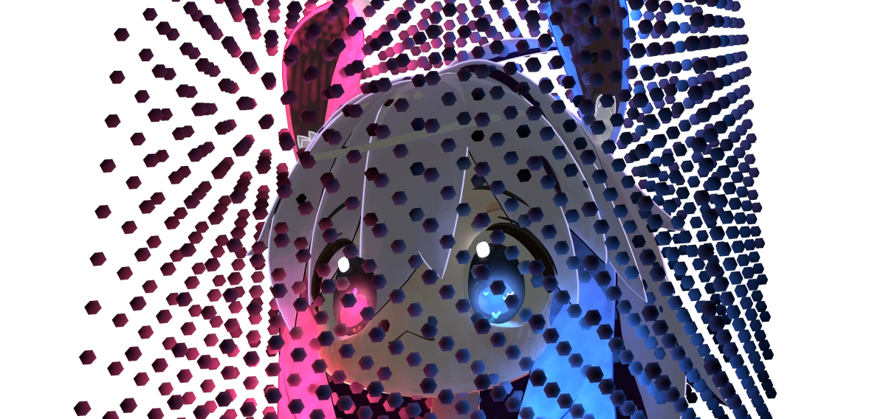
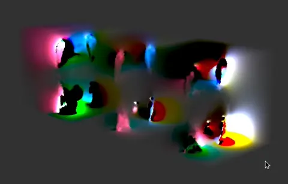

Hi, I'm Teeh. I recently started playing with VRC Light Volumes, and I have fallen in love. Let's explore a few of the foundations supporting VRC Light Volumes. This is absolutely not a tutorial and I'm not even going to touch on 90% of the cool stuff it can do.

For the most part, Volumes will replace Light Probe based lighting when it's available, so let's start there.

## Probe Lighting

 If you've ever set up a probe volume, you'll know that you (or whatever tool you're using) place something called a "probe" at each location in your scene that you want to store ambient lighting data for. Light probes measure diffuse environmental lighting, also known as irradiance, at a single point in your scene. It's important to understand that this measurement stores *incoming* light - it is up to the shader to run this through whatever shading function (typically some BRDF) to represent the target material's lighting characteristics. This lighting data is stored as a series of spherical harmonic coefficients in an array. At runtime, Renderers that are affected by probe lighting will have the CPU do a few things:
 - Find the four closest probes surrounding the renderer anchor point in a tetrahedron
	 - If you have an 'Anchor Override' set it will use the transform of that object
	 - If you don't, this defaults to the center of the bounding box for that mesh
 - Blend the influence of each probe based on the distance to the anchor
 - Ship that data off to the GPU as part of the draw call for that mesh

This happens for each dynamically lit mesh in your scene.
## SHs Taking Ls

It's not inaccurate to say that Volumes store the exact same info as Probes, but that's not the whole story. They both store, instead of simple RGB color values, a set of *Spherical Harmonic* (SH) coefficients. Probes store *up to* 9 coefficients per RGB channel, which corresponds to `L2` harmonics. Volumes only store 3 coefficients per RGB channel, which corresponds to `L1` harmonics. 

More harmonics let you encode the lighting at higher frequencies - effectively making them higher resolution. In layman's terms, more coefficients let you more sharply define environmental light, which for diffuse lighting luckily doesn't need to be super exact. There may still be a place for L2 Light Probes, especially considering how L1 harmonics need to be blurred (as in 'hanning window') a little to combat ringing artifacts. This is something I'll look more into, I'll share results if I find anything interesting. So far I think the benefits of lighting being volumetric with Volumes outweighs slightly increased lighting resolution with L2 Probes. 

There are a few benefits to storing lighting in SH coefficients, as opposed to something like cubemaps: no projection stretching, no distortions when rotated (orthonormal basis vs world AABB basis), they're quick to do math on (e.g. blurring), they are super quick to _use_ (shading with them ends up being a few dot products against the surface normal) and being as tiny as they are, they use way less memory bandwidth. These benefits come from working with lighting in _frequency_ space, as opposed to something more immediately intuitive like a cubemap's _position_ space. 

If you want to expand your understanding of spherical harmonics I recommend reading [Spherical Harmonics by PataBlog](https://www.Wpatapom.com/blog/SHPortal/) and [Stupid SH Tricks by Peter Pike Sloan at Microsoft](https://www.ppsloan.org/publications/StupidSH36.pdf). The main point I want to drive here is that the 3D texture that Volumes bake down to are *not* simple RGB colors that you can sample directly.
## So how *does* Volume lighting work?

I made a volume to store the light coming off of my little guy. You can't attach volumes to your avatar, this is just a demonstration.

So. You have:
- A scene. In that scene is a
	- Volume that takes up some 3D space which is itself split into many 
		- voxels which each store 
			- SH coefficients for that position's environmental lighting
- a mesh that's within the bounds of that 3D volume.

Instead of sampling a single point in 3D space and using that Probe to shade the entire mesh, we run a (fragment) shader on each pixel that:
- Uses the pixel's **world space** position to sample the 3D volume 
    - The 3D Texture sampled is an atlas of 3 3D Textures, so we need to tap it three times
    	- Using a 3D texture gives us bilinear interpolation to smooth the lighting out for samples in between voxels.
- Deliver the sampled SH coefficients to the shader.

This is an example of what a Light Volume Atlas can look like. First, all of the volumes in the scene are combined into an atlas (in this case there's a single volume) and that atlas is repeated 2 more times to store the additional SH coefficients.

No. Seriously. That's it. Light Volumes can be integrated into existing shaders so easily because **the end product is a set of SH coefficients** - just like with Light Probes!

Also notice how we didn't have to ask the CPU to do anything. The GPU already 'knows' the world space position of each pixel AND has the entirety of the Volume textures in VRAM, so it can do all that sampling itself. In *theory* we could skip all the light probe work being done on the CPU, but it's too closely integrated with the Built-In Rendering Pipeline for that juice to be worth the squeeze, also, very few worlds are going to have Volumes so you should maintain the ability to fall back to probes anyway.
### Important differences

- Probes can be placed arbitrarily in your scene. Volume voxels must be placed strictly on a grid.
- Probe coefficients are stored in an array accessed by the CPU, volume coefficients are stored in a 3D texture accessed by the GPU.
- Probes light meshes per-renderer based on an anchor sample position. Volumes light meshes per-pixel based on world-space position samples.

### Goodbye

I haven't touched on a fraction of the cool stuff VRCLV does, and I'm tempted to make a tutorial or something on how to set up LV and use them in place of Unity's traditional lightmapping. Let me know what you think!