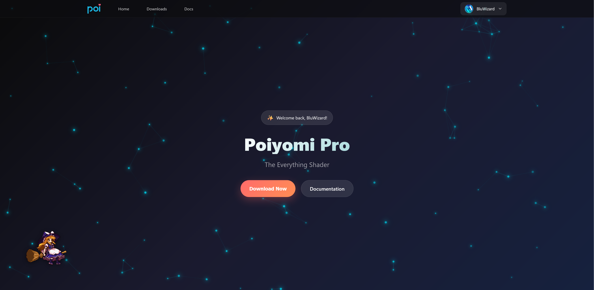

Patreon Subscribers, we have something special for you!

As of today, you can now download Poiyomi Pro from our new dedicated website. This will be the new place where you can obtain the latest versions of Poiyomi Pro without needing Discord.

 
<em>Example preview of the Poiyomi Pro website when logged in. You'll also notice it's accompanied by an animated [Marisa Kirisame <FAIcon icon="fa-solid fa-square-arrow-up-right"/>](https://en.touhouwiki.net/wiki/Marisa_Kirisame), a character from the Touhou Project.</em>

## How To Use The New Website

To use the new website, visit [pro.patreon.com <FAIcon icon="fa-solid fa-square-arrow-up-right"/>](https://pro.poiyomi.com) and follow these simple instructions...
1. Click the **"Login"** button on the header.
2. Click **"Continue with Patreon"** when prompted and a pop-up window will appear.
   - *If you don't see it, check with your Browser to see if a pop-up window was blocked.*
3. Login to your Patreon Account.
4. Once Logged In, you will see a page asking to authorize access. Click **"Allow"**.
5. The pop-up window will close and you will be redirected back to the website.
6. If you are subscribed to the $10+ Tier or above, you can now access the **"Downloads"** page! Go there to download the latest version of Poiyomi Pro.
7. and that's it! Install Poiyomi Pro as per usual into your Unity Project.

*There's also a little Easter Egg on the website (more like, a mini-game) that's playable in plain sight. Can you find it?*

### About Discord

From this point forward, you will still need to link your Patreon with your Discord Account in order to receive tech support from our Discord server. As always, linking your Patreon to your Discord will unlock a fancy role, some perks, and access to the `#paid-shader` channel where you can also download the same package from.

## VCC Support Coming Soon!

This new website is the first steps in creating a VCC-compatible version of the Pro shader! Support for this is currently under development and should hopefully be available soon for all Patreons to use in the near future.

We hope you enjoy using the new website! As always, thank you for being a Patreon subscriber!